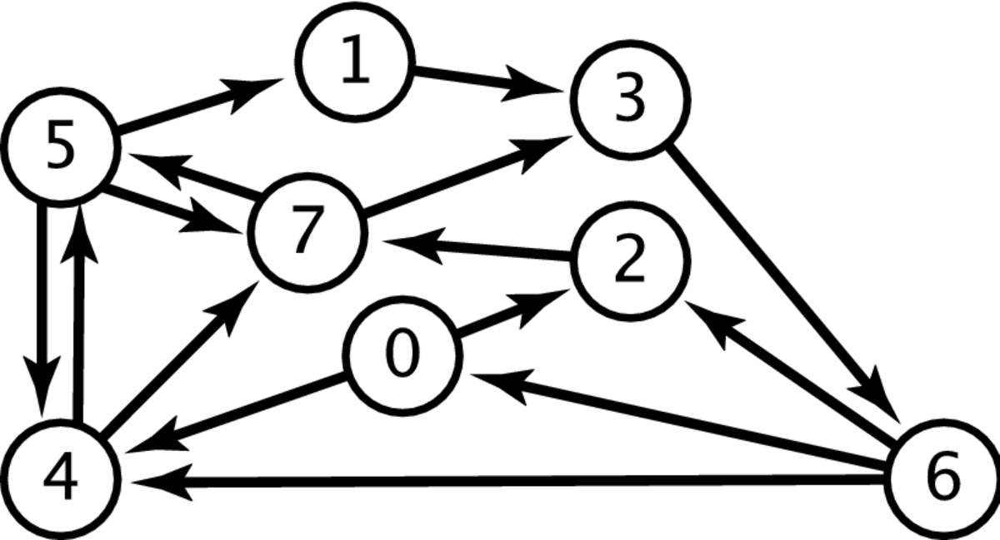

# Grafos: Algoritmo de Floyd-Warshall

#### Trabalho Prático da Disciplina de Algoritmo e Estrutura de Dados II

#### Gabriel Oliveira Alves

   

### Resumo
Este repositório tem o intuito de apresentar de forma resumida a teória dos grafos e implementar o algoritmo de Floyd-Warshall em um problema prático. A documentação refererente a este problema esta presente no arquivo [Documentation.md](Documentation.md).

## 1 - O que é um grafo?

Grafos, são estruturas discretas que consistem em vértices e aresta que ligam estes vértices. Dentro da teória de grafos, temos os ***Grafos Não-Orientados*** e os ***Grafos Orientados***(Digrafos ou grafos dirigidos), alguns possuem características únicas e são chamados de Grafos Especiais. Matemáticamente, um grafo pode ser representado por $G = (V,E)$, sendo $V$ um conjunto não vazio de vértices e $E$ o conjunto de arestas. No caso dos grafos orientados, cada aresta orientada está associada a um par ordenado de vértices. É dito que a aresta orientada associada ao par de vértices $ {(u,v)} $ começa em $u$ e termina em $v$.

- Dizemos que há um laço em um vértice quando, existe uma aresta que se liga a este mesmo vértice.
- Arestas paralelas são quando duas arestes ligam o mesmo par de vértices de forma igual.

 
Figura 1 - Representação de Grafo Não-Orientado.

 
Figura 2 - Representação de Grafo Orientado com múltiplas arestas.

 
Figura 3 - Tabela de terminologia de alguns grafos.

## 2 - Implementação de Grafos

Em literatura, temos 3 estruturas que podem representar um grafo. ***Lista de Adjacência***, ***Matriz de Adjacência*** e ***Matriz de Incidência***, apenas as duas primeiras estruturas serão abordadas. Estas estruturas são utilizadas para representar grafos nas implementações por meio de código em linguagem de programação.

> Quando um grafo apresenta uma quantidade substancialmente  grande de conexões e este grafo tem o seu conjunto de arestas $(|E|)$ proximo do conjunto de vértices ao quadrado $(|V^2|)$, dizemos que é um **Grafo Denso**.

> Quando o conjunto de arestas $(|E|)$ apresenta uma quantidade substancialmente menor que o conjunto de vértices ao quadrado $(|V^2|)$, dizemos que este é uma **Grafo Esparso**.

### 2.1 - Lista de Adjacência

A representação de lista de adjacências de um grafo $G = (V , E )$ consiste em um arranjo (vetor ou lista dinâmica) de Adj. de $|V|$ listas, uma para cada vértice em $V$. Logo, para cada $u ∈ V$, a lista de adjacência Adj[$u$] contém todos os vértices $v$ que definem uma aresta $(u, v ) ∈ E$.

  Figura 4 - Lista de Adjacência em grafo não-orientado.

  Figura 4 - Lista de Adjacência em grafo orientado.

De acordo com a literatura de referência, o custo do gasto de memória é dado por $\mathcal{O}(V+E)$ e é indicada para grafos esparsos.

### 2.2 - Matriz de Adjacência

## 3 - Algoritmo de Floyd-Warshall

## 4 - Referências

## Compilação e Execução

Para compiplar e executar o algoritmo, este repositório deve ser ***clonado***. Depois, acessar a pasta `code` de caminho **`Graph-Floyd-Warshall/code`** e Executar os comandos abaixo conforme suas funções.

| Comando                |  Função                                                                                           |                     
| -----------------------| ------------------------------------------------------------------------------------------------- |
|  `make clean`          | Apaga a última compilação realizada contida na pasta build                                        |
|  `make`                | Executa a compilação do programa utilizando o gcc, e o resultado vai para a pasta build           |
|  `make run`            | Executa o programa da pasta build após a realização da compilação                                 |

